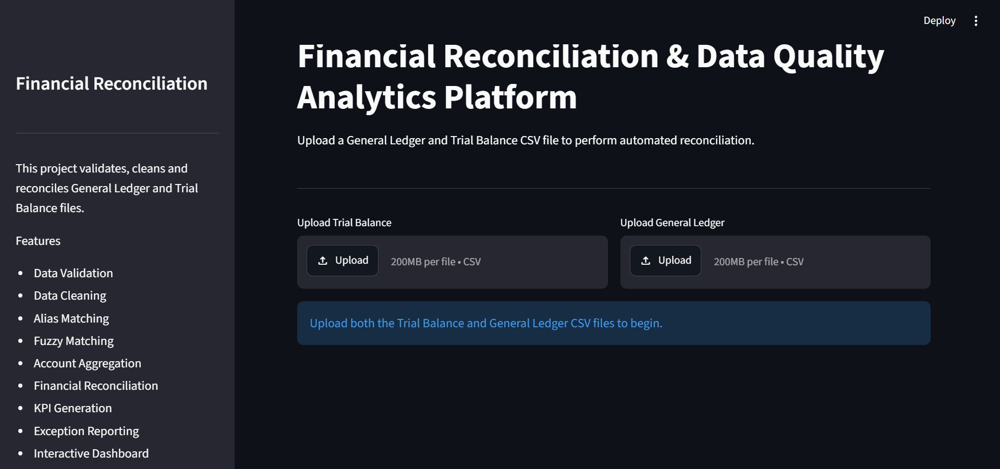
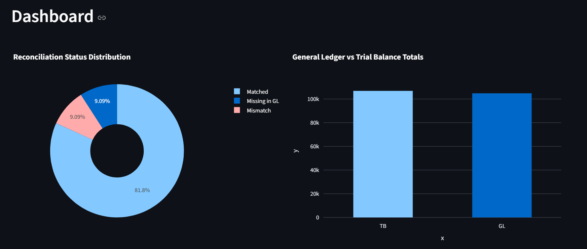
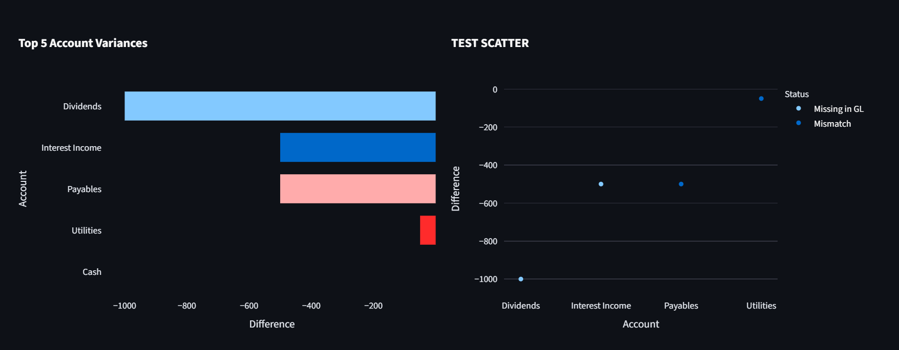
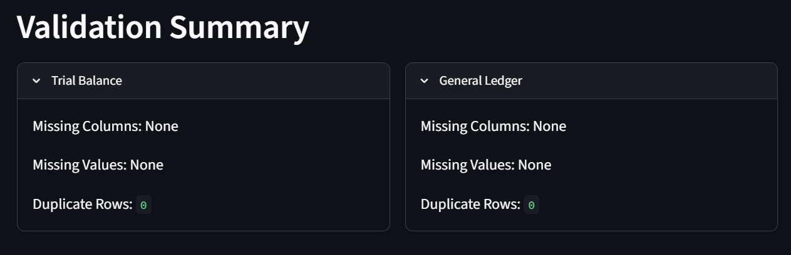
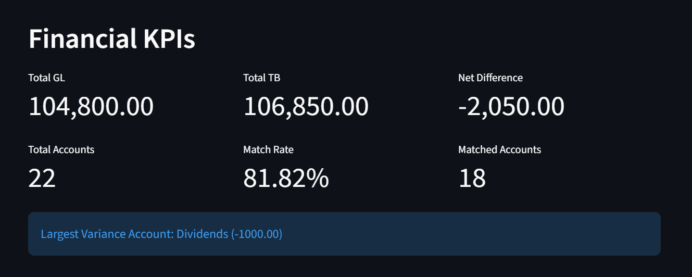
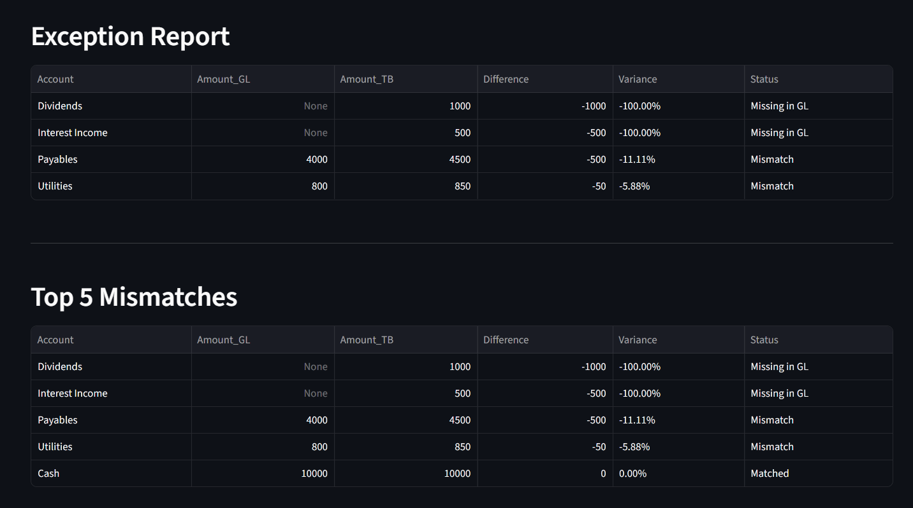

# Financial Reconciliation & Data Quality Analytics Platform

A production-style financial reconciliation and data quality analytics application built with Python, Pandas, Plotly, and Streamlit.

The platform validates, cleans, standardizes, matches, and reconciles General Ledger (GL) and Trial Balance (TB) datasets while generating KPIs, exception reports, and interactive dashboards.

---

## Demo

**Live Demo**

https://financial-reconciliation-platform.streamlit.app/

**Demo Video**


---

## Screenshots

### Dashboard





---

### Validation Summary



---

### KPI Dashboard




---

### Exception Report



---

## Features

- CSV file validation
- Schema validation
- Column standardization
- Missing value detection
- Duplicate detection
- Account name cleaning
- Amount cleaning & numeric conversion
- Alias matching
- Fuzzy account matching using RapidFuzz
- General Ledger aggregation
- Financial reconciliation
- Tolerance-based matching
- KPI generation
- Exception reporting
- Interactive Plotly dashboard
- CSV report export
- Streamlit interface

---

## Project Architecture

```
reconciliation-analysis/

│
├── app.py
├── main.py
│
├── data/
│   ├── raw/
│   ├── processed/
│   └── sample/
│
├── outputs/
│   ├── charts/
│   └── reports/
│
├── src/
│   ├── config.py
│   ├── validation.py
│   ├── preprocessing.py
│   ├── matching.py
│   ├── reconciliation.py
│   ├── kpi.py
│   ├── exception_engine.py
│   └── visualization.py
│
├── requirements.txt
└── README.md
```

---

## Workflow

```
Upload Files
      │
      ▼
Validation
      │
      ▼
Cleaning & Standardization
      │
      ▼
Alias Matching
      │
      ▼
Fuzzy Matching
      │
      ▼
Aggregation
      │
      ▼
Reconciliation
      │
      ▼
KPI Generation
      │
      ▼
Exception Reports
      │
      ▼
Visualization Dashboard
```

---

## Technologies Used

- Python
- Pandas
- NumPy
- Plotly
- RapidFuzz
- Streamlit

---

## Installation

Clone the repository

```bash
git clone <repository-url>
```

Install dependencies

```bash
pip install -r requirements.txt
```

Run the Streamlit application

```bash
streamlit run app.py
```

Run the command-line version

```bash
python main.py
```

---

## Reports Generated

The application automatically generates:

- Reconciliation Report
- Exception Report
- KPI Summary
- Top Mismatches Report

---

## KPIs

- Total Accounts
- Match Rate
- Total GL Amount
- Total TB Amount
- Net Difference
- Largest Variance Account

---

## Visualizations

- Reconciliation Status Distribution
- GL vs TB Comparison
- Top Account Variances
- Distribution of Reconciliation Differences

---

## Future Improvements

- PDF report generation
- Excel export
- User-defined tolerance
- Multi-file reconciliation
- Database integration
- Automated scheduling
- AI-assisted anomaly detection

---

## Author

**Mansha Khod**

B.Sc. Data Science

Mount Carmel College, Bangalore

